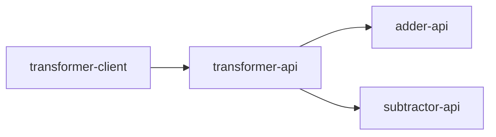

# Service Mesh Load Balancing

This project showcases how to use service mesh in Kubernetes for resolving gRPC load balancing issues.
The default load balancing in Kubernetes doesn't fit well with HTTP/2 because of the long-lived TCP connection design.
We will try out Linkerd and Istio service mesh for the demos.

Here, we created a few gRPC services(`transfomer-api`, `adder-api`, and `subtractor-api`) to communicate with each other.
The `transformer-client` is a command-line tool making requests and calculating the elapsed time for all the requests.



Tools we are using

## Minikube Setup

Minikube is used for local Kubernetes cluster setup. Please check out https://minikube.sigs.k8s.io/docs/ for more details.

### Installation

Please checkout out https://minikube.sigs.k8s.io/docs/start/ for more deatils.

Install minikube using homebrew
```bash
brew install minikube
```

Starts a local Kubernetes cluster
```bash
minikube start
```

### Manage Images

Using local docker images with minikube

List images from minikube
```bash
minikube image ls
```

Load an image into minikube after we built the docker image locally
```bash
minikube image load my_local_image
```

## Linkerd Setup

Linkerd is a service mesh for Kubernetes. Features: https://linkerd.io/2.12/features/

### Installation

Please check out https://linkerd.io/2.12/getting-started/ for more deatils.

Install the CLI
```bash
curl --proto '=https' --tlsv1.2 -sSfL https://run.linkerd.io/install | sh
```

Check your cluster is ready to install Linkerd
```bash
linkerd check --pre
```

Install Linkerd onto your cluster
```bash
linkerd install --crds | kubectl apply -f -
linkerd install | kubectl apply -f -
```

Verify your installation
```bash
linkerd check
```

### Observability

The Linkerd dashboard provides a high level view of what is happening with your services in real time.
Please check out https://linkerd.io/2.12/features/dashboard/ for more details.

Install the viz extension
```bash
linkerd viz install | kubectl apply -f -
```

Verify your installation
```bash
linkerd check
```

Access the dashboard
```bash
linkerd viz dashboard
```

## Istio Setup

Istio is also a service mesh. Features: https://istio.io/latest/docs/

### Installation

Please check out https://istio.io/latest/docs/setup/getting-started/ for more deatils.

Install the CLI
```bash
brew install istioctl
```

Install Istio onto your cluster
```bash
istioctl install --set profile=minimal
```

### Observability

Istio integrate multiple toolings for tracing/monitoring.
Please check out https://github.com/istio/istio/tree/master/samples/addons for more details.

Install addons for observability features
```bash
git clone https://github.com/istio/istio.git
cd istio && git checkout <installed-istio-version>
kubectl apply -f samples/addons
```

Access the kiali dashboard
```bash
istioctl dashboard kiali
```

## Usage

You could find all the instruction in Makefile.
Make sure you have installed minikube, linkerd, istio.
Also, we need toswitch the kubectl context to minikube and have the minikube running.


First we need to build all the local images using docker.
```bash
make build-images
```

Then we load all the local images into minikube.
```bash
make minikube-load-images
```

Next we deploy all the gRPC services without any service mesh setup. Each gRPC service has 3 replicas configuared.
```bash
make kubectl-deploy
```

After that we deploy CLI tool to check the output.
```bash
make kubectl-deploy-client
```

By checking the CLI tool log, you could see something similar to the one below.
Here we made hundreds of requests to transofmer service and all the requests forwarded to the same pod IP address.
There is no load balancing here.
```
...
2023/02/10 00:53:29 Response form tranformer service (10.244.0.170)
2023/02/10 00:53:29 Transform number input: 497
2023/02/10 00:53:29 Transform number output: 584
2023/02/10 00:53:29 Response form tranformer service (10.244.0.170)
2023/02/10 00:53:29 Transform number input: 498
2023/02/10 00:53:29 Transform number output: 155
2023/02/10 00:53:29 Response form tranformer service (10.244.0.170)
2023/02/10 00:53:29 Transform number input: 499
2023/02/10 00:53:29 Transform number output: 365
2023/02/10 00:53:29 Response form tranformer service (10.244.0.170)
2023/02/10 00:53:29 Transform number input: 500
2023/02/10 00:53:29 Transform number output: 607
2023/02/10 00:53:29 Response form tranformer service (10.244.0.170)
2023/02/10 00:53:29 Time elapsed for making 500 calls: 40.811264551s
```

(Optional) Cleanup deployed service, deployment and job
```bash
kubectl-cleanup
```

Next we could try using the linkerd. it will deploy extra proxy next to each service instance and it could be used for load balancing.
```bash
kubectl-deploy-with-linkerd
kubectl-deploy-client-with-linkerd
```

Right now you see the similar log to below and the load balancing is working with gRPC. Also, we got better performance with less time to complete all the requests.
Moreover, you could check the linkerd dashboard to monitor in real time.
```
...
2023/02/10 00:55:21 Transform number input: 497
2023/02/10 00:55:21 Transform number output: 757
2023/02/10 00:55:21 Response form tranformer service (10.244.0.182)
2023/02/10 00:55:21 Transform number input: 498
2023/02/10 00:55:21 Transform number output: 1026
2023/02/10 00:55:21 Response form tranformer service (10.244.0.180)
2023/02/10 00:55:21 Transform number input: 499
2023/02/10 00:55:21 Transform number output: 1092
2023/02/10 00:55:21 Response form tranformer service (10.244.0.181)
2023/02/10 00:55:21 Transform number input: 500
2023/02/10 00:55:21 Transform number output: 1305
2023/02/10 00:55:21 Response form tranformer service (10.244.0.182)
2023/02/10 00:55:21 Time elapsed for making 500 calls: 25.103076972s
```

Similarly we could do the same thing for istio by running the following commands.
```bash
kubectl-deploy-with-istio
kubectl-deploy-client-with-istio
```
